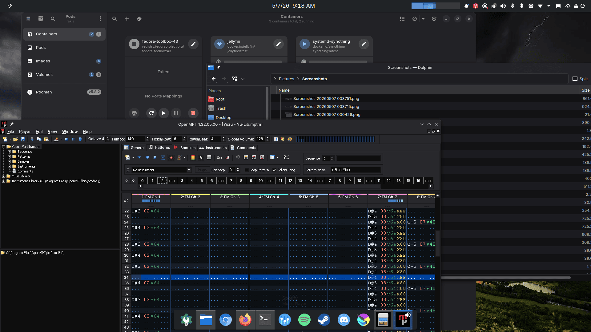

# Breeze Tonality Dark

An attempt to make Breeze and Wine fit in with Adwaita Dark a little better. And
as far as that goes, at this time it's close enough for me.Breeze-Tonality-Dark

## Download

[breeze-tonality-dark.tar.gz](breeze-tonality-dark.tar.gz)

## Building

I'm not gonna lie, the Python script is a mess. I decided to throw this
together. It builds a .colors file and a .reg file, and packages it into a
tarball, all silently, no options, no configuration. If you think it's a mess,
then we agree.

## Installing

### Plasma

On the Breeze color scheme, extract the .colors file from the tar.gz and in
System Settings -> Colors & Themes -> Colors click on `Install from File...` and
point that dialog box at the directory you extracted to.

For Wine, it's a little more complicated. Ideally, each application installed
will be installed in their own directory (or prefix) and each one handles their
own theming and colorschemes. In the screenshot above, OpenMPT is running; I
have that installed in `$HOME/.openmpt`.

So first, by default, Wine uses a theme. So we need to disable that by running:

> WINEPREFIX="$HOME/.openmpt" winecfg

In the Desktop Integration tab, set Theme to be `(No Theme)`.

Here's where you can also change your menu font to match your system font. Make
sure to set `Active Title Text`, `Menu Text`, and `Tooltip Text`. If someone
knows of a way to do this from the command line, please let me know.

From the directory you extracted the archive, run

> WINEPREFIX="$HOME/.openmpt" regedit breeze-tonality-dark.reg

Once the Wineserver has restarted, OpenMPT should look similar to the above.
